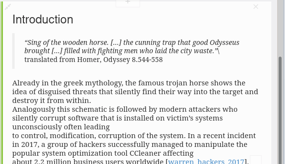

# html-filter
filter the markdown text for additional keywords and patterns

## How to use

Currently I use the `violentmonkey` extension for firefox to load this javascript extension on the gingkoapp website.

### With Violentmonkey

1. Install the `violentmonkey` extension
2. Create a new script in the its dashboard
3. Copy the contents from `examples/violent-monkey.js` into the script
4. Load the gingko-app homepage
5. Enjoy

#### Define new replacements

Currently you just alter the `REPLACEMENT` variable in the violent-monkey script.

For the moment there are only two additional filters that correspond to the `pandoc-markdown` syntax:

1. `{#xyz}` gets translated to an anchor with the name `xyz`
2. `@xyz` gets translated to a hyperlink to the anchor called `xyz`

#### Stay up to date

Using the violent monkey script you need to stay up to date with the new versions of the addon in `src/html-filter.js`.

